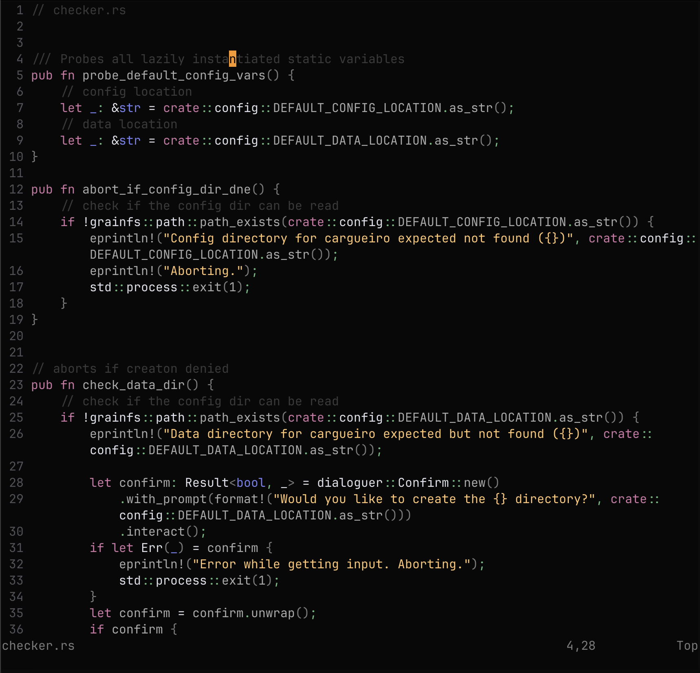

# Nightgem.nvim

A dark, minimalist colorscheme for Neovim with a carefully selected palette of charcoal black, soft greys, and accent colors designed for comfortable coding sessions.

## Screenshot



## Installation

### Using [lazy.nvim](https://github.com/folke/lazy.nvim)

```lua
{
  "alexkotusenko/nightgem.nvim",
  lazy = false,
  priority = 1000,
  config = function()
    require("nightgem").setup()
    vim.cmd("colorscheme nightgem")
  end,
}
```

## Color Palette

- Background: Charcoal Black (`#090809`)
- Foreground: Soft Grey (`#aaaaaa`)
- Yellow: Muted Purple (`#CE78A6`)
- Pink: Warm Gold (`#FEC671`)
- Blue: Pastel Blue (`#7781ee`)
- Green: Soft Mint (`#65BA7E`)
- Red: Error Red (`#ff6666`)

## Inspiration

- bluz71/vim-moonfly-colors for its charcoal black background color
- slugbyte/lackluster.nvim for its soft greys
